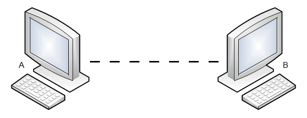

# Physical Layer of Computing (TeleCommunications)



This repository contains all the projects developed individually by Enricco Gemha, during the classes of the Physical Layer of Computing (2022/2), as he takes the Computer Engineering course.

*DISCLAIMER: Each project has its own instructions and studying material.*

Don't forget to install and activate the python ```venv```.

If you have any questions about the projects, send an email to: ```riccogemha@gmail.com```
